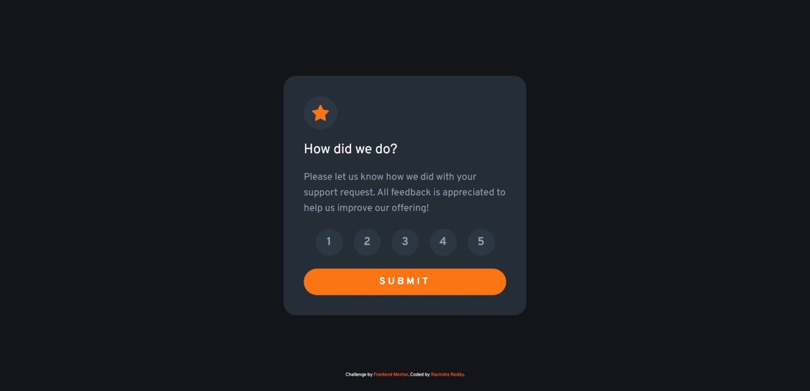
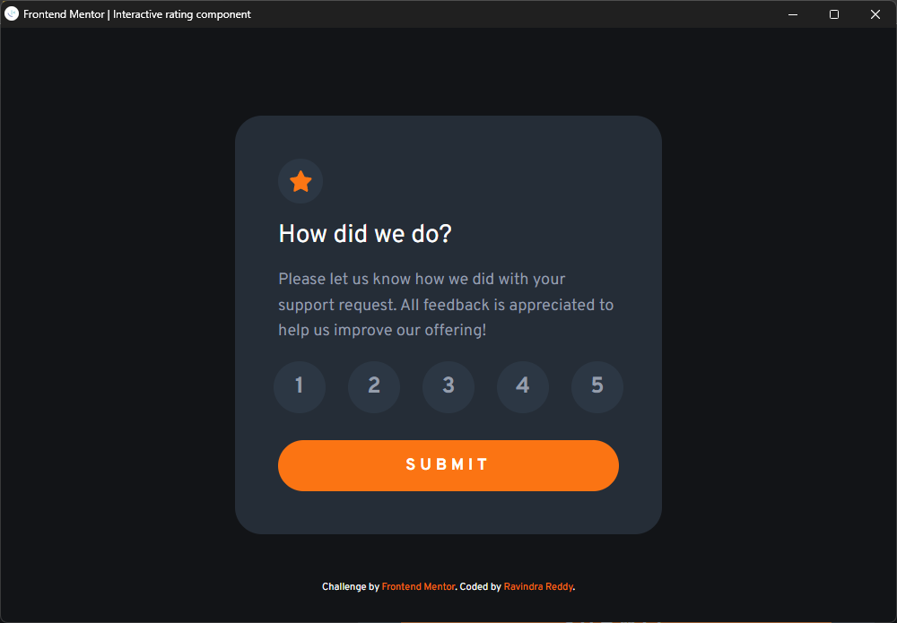
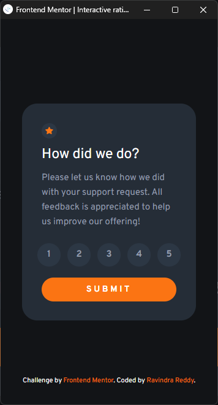
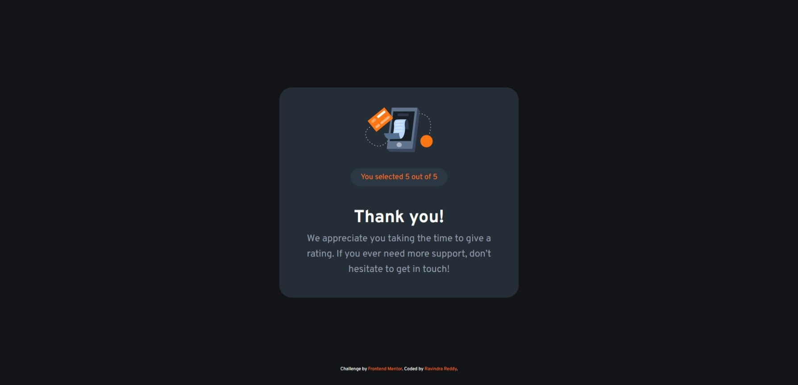

# Frontend Mentor - Interactive rating component solution




This is a solution to the [Interactive rating component challenge on Frontend Mentor](https://www.frontendmentor.io/challenges/interactive-rating-component-koxpeBUmI). Frontend Mentor challenges help you improve your coding skills by building realistic projects.

## Table of contents

- [Overview](#overview)
  - [The challenge](#the-challenge)
  - [Screenshot](#screenshot)
  - [Links](#links)
- [My process](#my-process)
  - [Built with](#built-with)
  - [What I learned](#what-i-learned)
  - [Useful resources](#useful-resources)
- [Author](#author)

**Note: Delete this note and update the table of contents based on what sections you keep.**

## Overview

### The challenge

Users should be able to:

- View the optimal layout for the app depending on their device's screen size
- See hover states for all interactive elements on the page
- Select and submit a number rating
- See the "Thank you" card state after submitting a rating

### Screenshot

1. Desktop View


2. Tablet View



3. Mobile View



4. After Rating - Thank You State




### Links

1. Solution URL : [Github Repo](https://github.com/ravindra135/interactive-rating-component-main)
2. Live URL     : [Live URL](https://ravindra135.github.io/interactive-rating-component-main/)

## My Process

### Built with

- HTML
- CSS
- JS

### What I learned

In this project you will find two view;
- index.html
- feedback.html

In, index.html you need submit a rating, which value will be carried forward to feedback page and shown over ther **"Check the Thank you state image above."**

So, I have used Radio Buttons as '1 - 5' points, the actual radio buttons are hidden and those you see are the labels check css on how to hide radio buttons;

```css
/* Hiding the actuall Radio Input */
input[type=radio] {
    display: none;
}

/* When Radio Input is Selected */
#star1:checked:checked ~ .star1 .rating,
#star2:checked:checked ~ .star2 .rating,
#star3:checked:checked ~ .star3 .rating,
#star4:checked:checked ~ .star4 .rating,
#star5:checked:checked ~ .star5 .rating {
    color: hsl(0, 0%, 100%);;
    background-color: hsl(217, 12%, 63%);
}
```

**NOTE or TIP:** If your Radio Button is Multiselect, but you want one at a time, them simply make all radio button's 'name' attribute same (check the code in index.html).

Now, passing the Radio Button Value to the Next HTML Page. 

As, I could have used PHP, or I can do it in the same page. But here, i decided to split two page and pass the value. I have written a JS Code (myapp.js)

**In myapp.js**, i declared all the radio button, then implemented a Event Listener on submit button;

```js
document.getElementById('submit').addEventListener('click', starSubmit);
// starSubmit is the function to be called when submit button is clicked;
```

**In that starSubmit function** : A if-else-if loop, to check which button radio button is checked;

```js
if(star1Value.checked) {
        value = star1Value.value;
        sessionStorage.setItem("star", value);
    } 
    else if(star2Value.checked) {
        value = star2Value.value;
        sessionStorage.setItem("star", value);
    } 
    else if(star3Value.checked) {
        value = star3Value.value;
        sessionStorage.setItem("star", value);
    } 
    else if(star4Value.checked) {
        value = star4Value.value;
        sessionStorage.setItem("star", value);
    } 
    else if(star5Value.checked) {
        value = star5Value.value;
        sessionStorage.setItem("star", value);
    } 
    // This is very important, when no radio button is selected, the value is set to 0; otherwise the var value will be undefined, and same will be carried forward;
    else {
        value = 0;
        // localStorage.setItem("star", value);
        sessionStorage.setItem("star", value);
    }

/*
What is localStroage ?

- The localStorage object allows you to save key/value pairs in the browser.

What is sessionStorage ?

- The sessionStorage object let you store key/value pairs in the browser.

Both of them do same thing, the only difference is, localStorage will store value until your browser data is cleared, whereas sessionStorage stores value for only one Session i.e. data will deleted after session close.
*/
```

Now, in Feedback.html

JS
```js
// Getting the Value;

let mStarValue = document.getElementById('starResult');
mStarValue.innerHTML = sessionStorage.getItem('star');
```
HTML
```html
 <p class="widget-text">You selected <span id="starResult">0</span> out of 5</p>
```

### Useful resources

- Session Storage : [Learn About It](https://www.w3schools.com/jsref/prop_win_sessionstorage.asp)
- Local Storage : [Learn About It](https://www.w3schools.com/jsref/prop_win_localstorage.asp)

## Author

- Frontend Mentor - [@ravindra135](https://www.frontendmentor.io/profile/ravindra135)
- Github - [@ravindra135](https://github.com/ravindra135/)
- Instagram - [@ravindra_since2k](https://www.instagram.com/ravindra_since2k/)